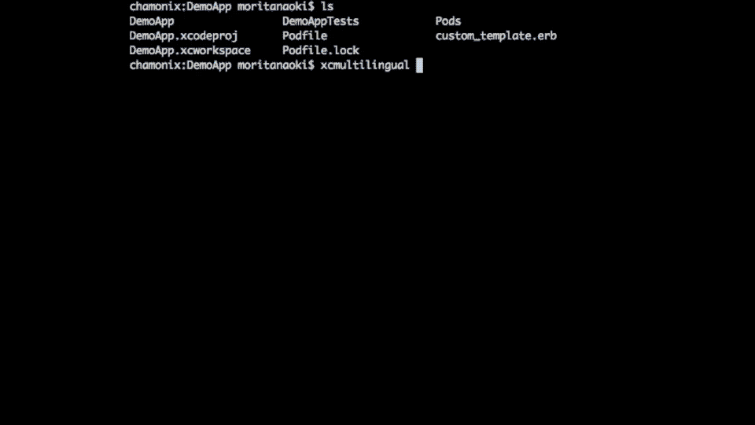

# xcmultilingual

Command line tool for Swift localizations: It parses localization files in the project and generate swift file including functions with neat complementations!

[](http://badge.fury.io/rb/xcmultilingual) [](https://gitter.im/morizotter/xcmultilingual?utm_source=badge&utm_medium=badge&utm_campaign=pr-badge&utm_content=badge)

RubyGems: [xcmultilingual](https://rubygems.org/gems/xcmultilingual)



## CANGELOG

See [CANGELOG](CHANGELOG.md) for update information.

### Recent breaking changes

- **0.3.0** Getting localized value now from `value` computed property. It was `string()` function.

## Installation

Add this line to your application's Gemfile:

```ruby
gem 'xcmultilingual'
```

And then execute:

    $ bundle

Or install it yourself as:

    $ gem install xcmultilingual

## Usage

### 1. Install xcmultilingual instructed above.

This is command line tool distributed with [RubyGems.org](https://rubygems.org/).

### 2. Create empty swift file in top level of project tree.

Named as `Multilingual.swift` in this example. **xcmultilingual** parses same and lower directries' .bundle and .lproj.

```bash
.
├── DemoApp
│   ├── AppDelegate.swift
│   ├── Base.lproj
│   ├── Images.xcassets
│   ├── Info.plist
│   ├── Loalizations
│   ├── Multilingual.swift
```

### 3. Execute update command with destination file path

```bash
$ xcmultingual update ./DemoApp/Multilingual.swift
```

And then convenient functions will be generated in destination swift file.

Example:

```swift
import Foundation

struct Multilingual {
    enum Animal: String {
        case CAT = "CAT"
        case DOG = "DOG"
        case BEAR = "BEAR"
        case DEER = "DEER"
        case SQUIRREL = "SQUIRREL"
        case ELEPHANT = "ELEPHANT"
        case GIRAFFE = "GIRAFFE"
        case TIGER = "TIGER"
        case LION = "LION"
        case RABBIT = "RABBIT"
        case RHINOCEROS = "RHINOCEROS"
        case GORILLA = "GORILLA"
        case MONKEY = "MONKEY"

        var value: String {
            return NSLocalizedString(rawValue, tableName: Animal.name, bundle: NSBundle.mainBundle(), value: rawValue, comment: "")
        }

        static let name = "Animal"

        static var keys: [String] {
            return ["CAT", "DOG", "BEAR", "DEER", "SQUIRREL", "ELEPHANT", "GIRAFFE", "TIGER", "LION", "RABBIT", "RHINOCEROS", "GORILLA", "MONKEY"]
        }

        static var localizations: [String] {
            return Animal.keys.map { Animal(rawValue: $0)!.value }
        }
    }

    enum Localizable: String {
        case HELLO = "HELLO"
        case GOODMORNING = "GOODMORNING"
        case GOODEVENING = "GOODEVENING"

        var value: String {
            return NSLocalizedString(rawValue, tableName: Localizable.name, bundle: NSBundle.mainBundle(), value: rawValue, comment: "")
        }

        static let name = "Localizable"

        static var keys: [String] {
            return ["HELLO", "GOODMORNING", "GOODEVENING"]
        }

        static var localizations: [String] {
            return Localizable.keys.map { Localizable(rawValue: $0)!.value }
        }
    }

    enum SampleSample: String {
        case SAMPLE = "SAMPLE"

        var value: String {
            return NSLocalizedString(rawValue, tableName: SampleSample.name, bundle: Multilingual.bundle("sample.bundle"), value: rawValue, comment: "")
        }

        static let name = "Sample"

        static var keys: [String] {
            return ["SAMPLE"]
        }

        static var localizations: [String] {
            return SampleSample.keys.map { SampleSample(rawValue: $0)!.value }
        }
    }


    private static func bundle(relativePath: String) -> NSBundle {
        var components = (__FILE__ as String).pathComponents
        components.removeLast()
        let bundlePath = join("/", components) + "/" + relativePath
        return NSBundle(path: bundlePath) ?? NSBundle.mainBundle()
    }
}
```

### 4. Use with complementations!!

And now, you can access your localization string with pretty good complementations.

For example, when write: Multilingual, complementations are below:

```swift
Multilingual.Localizable
Multilingual.Animal
```

And then, select `Multilingual.Animal`, complementations are blow:

```swift
Multilingual.Animal.CAT
Multilingual.Animal.DOG
Multilingual.Animal.BEAR
Multilingual.Animal.DEER
```

Awesome!

And print localized string is:

```swift
Multilingual.Animal.DOG.value
```

Easy!

## Commands

**update:** Update swift file. DESTINATION is required.

options:
- `-name` or `-n`: Change Localization struct name. Default is Multilingual.
- `-template` or `-t`: Use custom template for generating swift file. You can copy original and change where you want!
- `--verbose`: Output execution logs

**help:** Write `update` after help and show update options' help.

If you want to use `LOC` for top level struct name. `xcmultilingual update ./DemoApp/Multilingual.swift -n LOC` and then you can write like `LOC.Animal.DOG.value`

## Swift functions

`Multilingual` is swift struct. Localization tables are represented as enum in this struct.

Each enum has `value` instance computed property and Table `name`, `keys` and `localizations` static computed properties.

Example:

When you want to use Animal table's DOG key localization.

```swift
Multilingual.Animal.DOG.value // Dog
```

When you want to show every localizations in test.

```swift
Multilingual.Animal.localizations() // ["Cat", "Dog", "Bear", "Dear"]
```


## Contributing

Bug reports and pull requests are welcome on GitHub at https://github.com/morizotter/xcmultilingual. This project is intended to be a safe, welcoming space for collaboration, and contributors are expected to adhere to the [Contributor Covenant](contributor-covenant.org) code of conduct.

## License

The gem is available as open source under the terms of the [MIT License](http://opensource.org/licenses/MIT).
